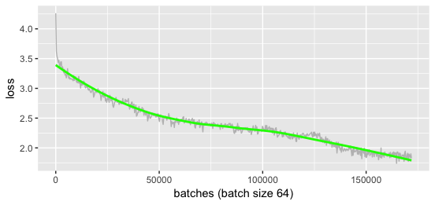

# aiComposer

Automatic music generation

### How to use

First, clone the branch: `dynamic`:

```
 git clone -b dynamic --single-branch https://github.com/peter0749/aiComposer_multiple_instruments
```

Enter the repository:

```
cd aiComposer_multiple_instruments/multiple_instruments
```

Download the model for dynamics and place it under the same directory of `music_generator.py`.

[model for dynamics](https://github.com/peter0749/aiComposer_multiple_instruments/releases/download/v0.1.0/velocity.h5)

Rename it to `velocity.h5`.

Download the model and place it under the same directory of `music_generator.py`.

[model with mozart style](https://github.com/peter0749/aiComposer_multiple_instruments/releases/download/v0.1.0/mz.h5)

Rename it to `multi.h5`.

Finally, generate some music with mozart style!

```
python music_generator.py mz.mid --n 800 --note_temp 0.6 --delta_temp 0.6 --vol_temp 0.4 --align 2 --finger_number 5 --init zero --bpm 100 --debug
```

The generated midi file is named `mz.mid`. 

Under the same directory of `music_generator.py`

The `mz.mid` file should be identical to the file `example/mz.mid`.

If you want to generate different music, just remove the `--debug` argument.

You can also try to generate different style of music with different model.

Which is the `multi.h5` file.

All trained models are in the `release` tag.

### Model List

Model of different styles

[fugue](https://github.com/peter0749/aiComposer_multiple_instruments/releases/download/v0.1.0/fugue.h5)

[jazz](https://github.com/peter0749/aiComposer_multiple_instruments/releases/download/v0.1.0/jazz.h5)

[jig](https://github.com/peter0749/aiComposer_multiple_instruments/releases/download/v0.1.0/jig.h5)

[waltz](https://github.com/peter0749/aiComposer_multiple_instruments/releases/download/v0.1.0/waltz.h5)

[touhou?!](https://github.com/peter0749/aiComposer_multiple_instruments/releases/download/v0.1.0/touhou.h5)

[folk](https://github.com/peter0749/aiComposer_multiple_instruments/releases/download/v0.1.0/nott.h5)

### Arguments

```

music_generator.py [-h] [--n N] [--note_temp NOTE_TEMP]
                          [--delta_temp DELTA_TEMP] [--temp_sd TEMP_SD]
                          [--finger_number FINGER_NUMBER] [--align ALIGN]
                          [--bpm BPM] [--do_format] [--debug] [--init INIT]
                          [--sticky] [--main_instrument MAIN_INSTRUMENT]
                          midi

Music Generation

positional arguments:
  midi                  Path to the output midi file.

optional arguments:
  -h, --help            show this help message and exit
  --n N                 Number of notes to generate.
  --note_temp NOTE_TEMP
                        Temperture of notes.
  --delta_temp DELTA_TEMP
                        Temperture of time.
  --temp_sd TEMP_SD     Standard deviation of temperture.
  --finger_number FINGER_NUMBER
                        Maximum number of notes play at the same time.
  --align ALIGN         Main melody alignment.
  --bpm BPM             Bpm (speed)
  --do_format           Format data before sending into model...
  --debug               Fix random seed
  --init INIT           Initialization: seed/random/zero (default: zero)

```

`note_temp` controls the "creativity" of pitch. Higher `note_temp` means higher "creativity" but less regularity, and Vice versa.

`delta_temp` controls the "creativity" of rythm. Higher `delta_temp` means higher "creativity" but less regularity, and Vice versa.

### Training loss plot

Only show validation loss plots and accuracy plots of `nott.h5` and `mz.h5`

Plots of `nott.h5`:


Plots of `mz.h5`:




